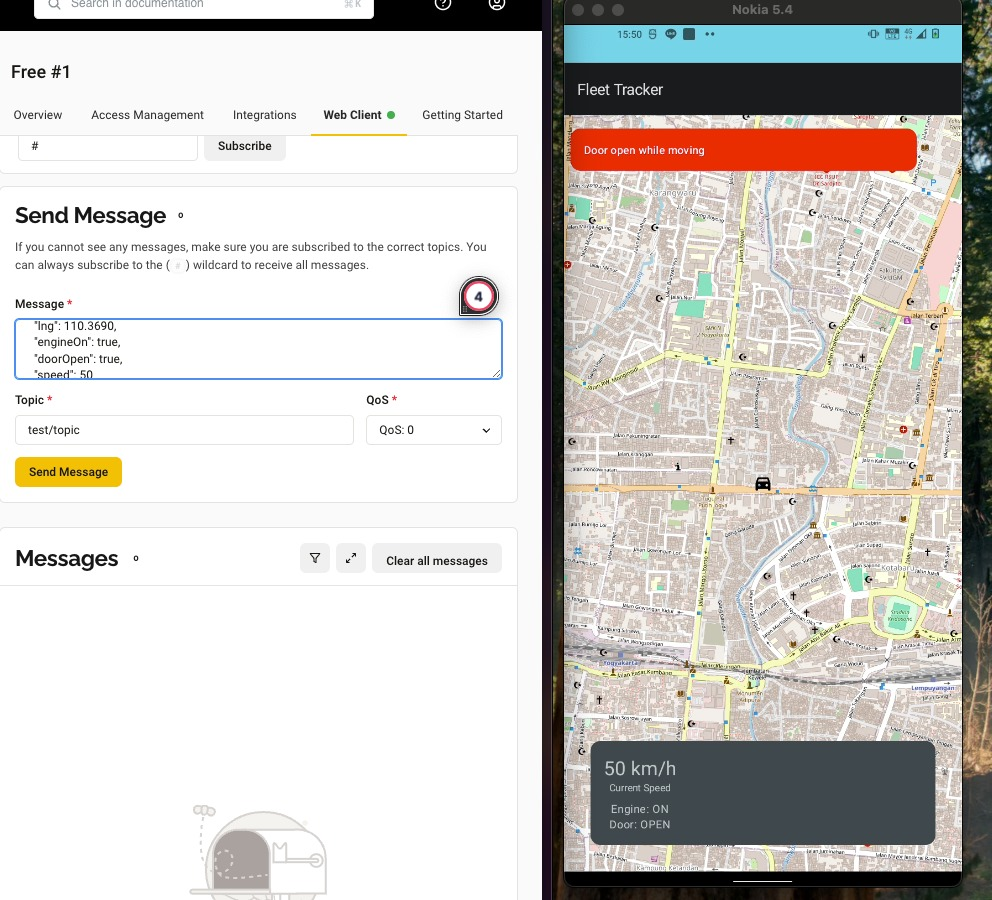

# Mini Fleet Tracker
## Setup Instruction
1. Clone this repository
2. Build and run the App Module

## Design and Dependencies
1. MVVM, not cleaned yet (DI not implemented yet, got error for my old version of Android Studio to implement Hilt with KSP and i didn't have much time to work around)
2. OpenStreetMap (OSM) for Maps
3. Jetpack Compose
4. Kotlin Coroutines
5. MQTT Connection

## Run Simulation
1. Connect to MQTT server and publish message to same Topic and QOS: 0 using the publisher account
\nMQTT Host : 
    TLS MQTT URL : 66fde72f2b504a62a2a89926aae05d9f.s1.eu.hivemq.cloud:8883
    TLS Websocket URL : ws://66fde72f2b504a62a2a89926aae05d9f.s1.eu.hivemq.cloud:8884/mqtt
Topic : test/topic
username : publisher
password : Publisher1
2. Format Message
   ```
   {
   "vehicleId":String,
   "lat":Double,
   "lng":Double,
   "engineOn":Boolean,
   "doorOpen":Boolean,
   "speed":Int
   } 
   ```
    example :
   ```{
   "vehicleId":"1",
   "lat":-7.783037,
   "lng":110.375,
   "engineOn":true,
   "doorOpen":false,
   "speed":10
   } 
   ```
## Simulation Example
using free MQTT provided in previous section
1. First time connect to the MQTT using the publisher, the maps will show and the Location of vehicle will not showing
   
2. Publish the message to update the vehicle status
   
3. Publish the message to update the engine Start or ON
   
4. Publish the message to update the vehicle location
   
5. Publish the message to update the vehicle Door
   
6. Publish the message to update the vehicle Speed
   
7. Show the alert
   